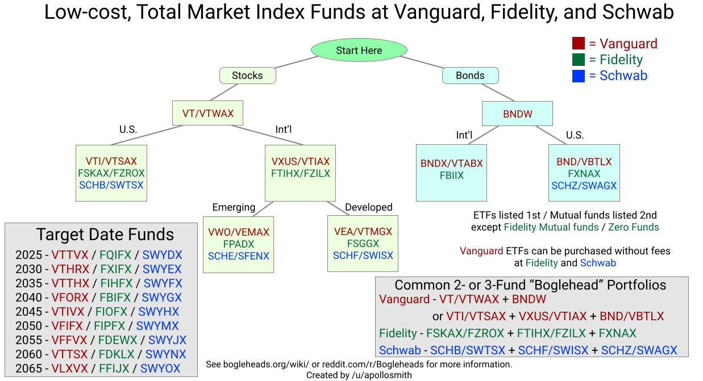
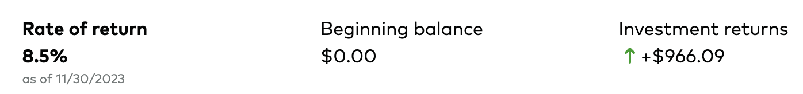
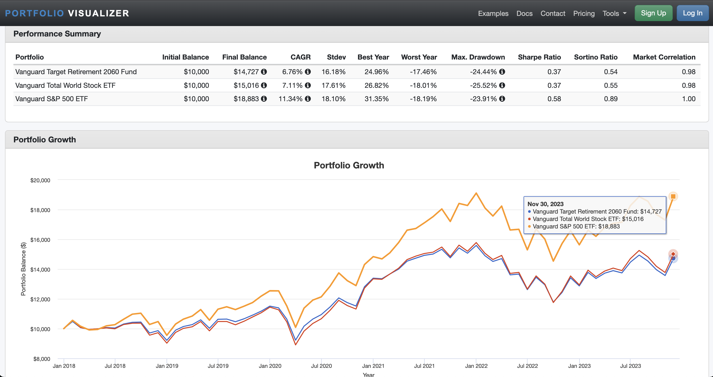

# Resources & links

- [Portfolio visualizer](https://www.portfoliovisualizer.com/backtest-portfolio?s=y&timePeriod=4&startYear=2018&firstMonth=1&endYear=2023&lastMonth=12&calendarAligned=true&includeYTD=true&initialAmount=10000&annualOperation=0&annualAdjustment=0&inflationAdjusted=true&annualPercentage=0.0&frequency=4&rebalanceType=1&absoluteDeviation=5.0&relativeDeviation=25.0&leverageType=0&leverageRatio=0.0&debtAmount=0&debtInterest=0.0&maintenanceMargin=25.0&leveragedBenchmark=false&reinvestDividends=true&showYield=false&showFactors=false&factorModel=3&portfolioNames=false&portfolioName1=Portfolio+1&portfolioName2=Portfolio+2&portfolioName3=Portfolio+3&symbol1=VTTSX&allocation1_1=100&symbol2=VT&allocation2_2=100)
- [r/Bogleheads](https://www.reddit.com/r/Bogleheads)
  - [Should I invest in [X] index fund? (A simple FAQ thread)](https://www.reddit.com/r/Bogleheads/comments/tg1az5/should_i_invest_in_x_index_fund_a_simple_faq/)
  - [Stay the course](https://www.reddit.com/r/Bogleheads/comments/12byegv/stay_the_course/)

---

# Introductory vocabulary

> Just getting started...

## Stocks
- A stock, also known as an **equity**, is a security that represents the ownership of a fraction of the issuing corporation. Units of stock are called "shares" which entitles the owner to a proportion of the corporation's assets and profits equal to how much stock they own. 
- How Can You Earn Income From Owning Stock?
  - There are two ways to earn money by owning shares of stock is through **dividends** and **capital appreciation (gains)**. 
  - **Dividends** are cash distributions of company profits. If a company has 1,000 shares outstanding and declares a $5,000 dividend, then stockholders will get $5 for each share they own. 
  - **Capital appreciation** is the increase in the share price itself. If you sell a share to someone for $10, and the stock is later worth $11, the shareholder has made $1

## Bonds
- Often used interchangably with **fixed-income**
- A bond is a fixed-income instrument that represents a loan made by an investor to a borrower (typically corporate or governmental). A bond could be thought of as an I.O.U. between the lender and borrower that includes the details of the loan and its payments. Bonds are used by companies, municipalities, states, and sovereign governments to finance projects and operations. Owners of bonds are debtholders, or creditors, of the issuer.
- Most bonds share some common basic characteristics including:
  - Face value (par value) is the money amount the bond will be worth at maturity; it is also the reference amount the bond issuer uses when calculating interest payments. For example, say an investor purchases a bond at a premium of $1,090, and another investor buys the same bond later when it is trading at a discount for $980. When the bond matures, both investors will receive the $1,000 face value of the bond.
  - The coupon rate is the rate of interest the bond issuer will pay on the face value of the bond, expressed as a percentage. For example, a 5% coupon rate means that bondholders will receive 5% x $1,000 face value = $50 every year.
  - Coupon dates are the dates on which the bond issuer will make interest payments. Payments can be made in any interval, but the standard is semiannual payments.
  - The maturity date is the date on which the bond will mature and the bond issuer will pay the bondholder the face value of the bond.
  - The issue price is the price at which the bond issuer originally sells the bonds. In many cases, bonds are issued at par.

## Capital Gains
- A **capital gain** refers to the increase in the value of a capital asset that is realized when it is sold. In other words, a capital gain occurs when you sell an asset for more than what you paid to purchase it
- Almost any type of asset you own is a capital asset. They can include investments such as stock, bonds, or real estate, and items purchased for personal use, such as furniture or a boat
- The gain may be **short-term** (one year or less) or **long-term** (more than one year) and must be reported on income tax returns
- **Unrealized gains and losses** reflect an increase or decrease in an investment's value but are not considered taxable

## Mutual Fund

- "Mutual funds let you pool your money with other investors to "mutually" buy stocks, bonds, and other investments. They're run by professional money managers who decide which securities to buy (stocks, bonds, etc.) and when to sell them. You get exposure to all the investments in the fund and any income they generate."
- "Buying mutual funds can be straightforward. Many banks and brokerage firms, including Schwab, have their own line of proprietary mutual funds as well as access to thousands of third-party funds."
- "You get the benefit of having a professional manager reviewing and researching the fund's portfolio on an ongoing basis."
- [link](https://www.schwab.com/mutual-funds/understand-mutual-funds)

### Types of Mutual Funds

- Equity funds
  - These funds invest in U.S. or foreign stocks. Some are index funds, while others are actively managed. Typically, they're defined by the size of the companies they invest in ("small-cap," "mid-cap," or "large-cap") or their investment objective ("growth," "income," etc.).
- Target date funds
  - A type of asset allocation fund where the mix of securities and asset classes—equities and fixed income for example—gradually shift as your target date for needing the money (usually for retirement) draws near.
- Asset allocation funds
  - These funds will allocate a specific amount to fixed income and equities depending on the fund's goal. They typically offer income and growth potential in one fund.
- Index funds
  - These funds comprise a portfolio of securities that attempt to mimic the performance of a specific index, such as the S&P 500® index. They offer a low-cost, straightforward way to track an index that's generally more tax efficient than actively managed funds.
- Money market funds
  - These funds generally invest in cash equivalents such as U.S. Treasury bills and CDs. They're lower-risk investments and tend to offer better returns than savings accounts, but they are not insured by the FDIC.
- Environmental, Social and Governance (ESG) funds
  - These funds consider noneconomic principles in their selection and weighting of securities, such as environmental responsibility, human rights, or religious views. Can also include funds that avoid investing in certain industries, such as defense, alcohol, tobacco, or gambling.
- Commodity funds
  - These funds invest in companies involved in commodity-intensive industries such as energy exploration and mining. While these funds can be a great hedge against inflation, they can also be more volatile than most stock funds.

## Exchange-Traded Fund (ETF)
- ETFs are similar to mutual funds. They represent professionally managed collections (or "baskets") of individual stocks or bonds. Similar to mutual funds, ETFs and are managed by experts. Those experts choose and monitor the stocks or bonds the funds invest in, saving you time and effort.

## Mutual Funds vs ETFs
- ETFs trade like stocks and are bought and sold on a stock exchange, experiencing price changes throughout the day, while mutual fund purchases are executed once per day, with all investors on the same day receiving the same price.
- ETFs do not require a minimum initial investment and are purchased as whole shares. You can buy an ETF for the price of just one share, usually referred to as the ETF's "market price." Mutual funds often have higher initial inventment minimums.
- ETFs are often less expensive than mutual funds because they require less active management
- You may need to pay a trading commission when you invest in an ETF, but this usually doesn't apply to mutual funds
- In general, ETFs tend to be more tax efficient than index mutual funds
  - ETFs can potentially generate fewer capital gains for investors since they may have lower turnover and can use the in-kind creation/redemption process to manage the cost basis of their holdings'
  - [Link](https://am.jpmorgan.com/us/en/asset-management/adv/insights/etf-insights/tax-efficiency-of-etfs/#:~:text=ETFs%E2%80%94both%20passive%20and%20active%E2%80%94consistently%20distribute%20significantly%20fewer%20capital,mutual%20funds%20for%20many%20investors.)
  

---

# Retirement Investing & Employer Benefits

## 401(k) and 403(b)

- Employer-sponsored retirement plan offered by many for-profit companies
- 401(k) plans and 403(b) plans are **tax-advantaged**, meaning workers can preserve more of their investment growth for retirement rather than losing some to taxes each year.
- Once the money is in your 401(k), and as long as the money remains in the account, you pay no taxes on investment growth, interest, dividends or earnings
- Most 401(k) and 403(b) plans are pre-tax accounts, meaning the money contributed is generally withdrawn from employees’ paychecks before taxes. This helps those workers to pay less in taxes that year. The money then grows tax-deferred in the account, and employees don’t pay income taxes on the money until they withdraw it during retirement.
- Many 401(k) and 403(b) plans also accept Roth contributions. Rather than being made pre-tax, Roth contributions are made after an employee has already paid taxes on their income. Then, all investment growth in the account and distributions from the account are tax-free
- Both 401(k) and 403(b) plans are subject to contribution limits. First, in both cases, employees can contribute up to $22,500 of their income to their workplace retirement plan in 2023
- NOTE: Employer matches are Traditional, not Roth!
  - Roth 401(k) plans are typically matched at the same rate as traditional 401(k) plans. **However, with a Roth 401(k), the matching contributions provided by an employer are placed in a traditional 401(k), while employee contributions are held in the Roth 401(k)**

## Individual retirement account (IRA)

- Individual retirement accounts (IRAs) are **personal** (not employer-sponsored) retirement savings accounts that offer tax benefits (sometimes called **tax advantaged** for this reason) and a range of investment options. Many investors use IRAs as their common source of saving for retirement.
- Even those with access to employer-sponsored plans, such as a 401(k) or 403(b), still tap into IRA tax advantages to boost their savings and add flexibility to their portfolio. 
- Most commonly chosen individual retirement options compared ([link](https://www.schwab.com/ira/roth-vs-traditional-ira)):
  - **Traditional IRA**
    - With a Traditional IRA, you contribute pre-tax dollars,your money grows tax-deferred, and withdrawals are taxed as current income after age 59½.
    - **Best suited for:** an individual who expects to be in the same or lower tax bracket when he or she starts taking withdrawals
    - **2023 contribution limit:** $6,500
    - **Contributions are tax deductible**
    - **Income limit:** None
  - **Roth IRA**
    - With a Roth IRA, you contribute after-tax dollars, your money grows tax-free, and you can generally make tax- and penalty-free withdrawals after age 59½
    - **Best suited for:** an individual who expects to be in a higher tax bracket when he or she starts taking withdrawals
    - **2023 contribution limit:** $6,500
    - **Contributions are tax NOT deductible**
    - **Income limit:** "to contribute to a Roth IRA, single tax filers must have a modified adjusted gross income (MAGI) of less than $153,000 in 2023. In 2024, the threshold rises to $161,000"
  - **Rollover IRA**
    - One way to take control of your retirement savings is to roll over your prior retirement plan from a former employer.
    - It is a process that allows you to move funds from your previous employer-sponsored retirement plan, a 401(k), for example, into an IRA. When you roll over your old retirement account into an IRA, you can preserve the tax-deferred status of your retirement assets without paying current taxes or early withdrawal penalties at the time of transfer. 

## Health Savings Account (HSA)

- An [HSA](https://www.fidelity.com/learning-center/smart-money/what-is-an-hsa) is a tax-advantaged account that can be used to pay for qualified medical expenses, including copays, prescriptions, dental care, contacts and eyeglasses, bandages, X-rays, and a lot more. It’s "tax-advantaged" because your contributions reduce your taxable income, and the money isn't taxed while it’s in the account—even if it earns interest or investment returns. Bonus: As long as you use your HSA funds for qualified medical expenses, you won't owe taxes when you take money out of the account. These 3 reasons are why HSAs are considered "triple" tax advantaged. This means they provide more tax advantages than retirement accounts, such as 401(k)s or individual retirement accounts (IRAs).
- **To be eligible, you must participate in a High Deductible Health Plan (HDHP)**, have no other insurance coverage other than those specifically allowed, and not be claimed as a dependent on someone else's tax return in order to be eligible for an HSA
- If you don't need the money in your HSA for immediate medical expenses, you can save and invest it until you do. This sets HSAs apart from another popular account, the health care flexible spending account (FSA). Unlike an HSA, money held in a health care FSA typically must be spent by the end of the plan year in which it's contributed, can't be invested, and can't be carried with you when you leave an employer
- HSAs are not subject to "use-it-or-lose-it" rules This means you don't forfeit any money you don't use in a given year, and you can carry it forward until you reach a time that you want or need to use the money in your HSA
- Your HSA is your account, not your employer's. Unlike health care FSAs, which your employer technically owns, your HSA belongs to you. So when you leave a job, you keep all of the money you've saved up in your HSA and can transfer into a new HSA or employer-sponsored HSA at your next job
- Contributing to your HSA early and often and investing those savings can help you better afford medical care later. The contribution limit for 2023 is $3,850 for individual coverage and $7,750 for family coverage.
- You and your employer may both contribute to your HSA, though the contribution limit remains the same, regardless of how much your employer puts in

## Choosing Retirement Investments 

> Putting it all together...

### The 3 Fund Portfolio

- The folks over on `r/Bogleheads` suggest that a portfolio comprising these 3 main investments is a gold standard:

1. A pure US stock market index fund
2. A pure international stock market index fund
3. A bond index fund

The relative proportions depend on your risk-tolerance and age, but for 20-somethings, this seems to be something like 60/30/10 or 70/30/0 etc..



### Target Date Fund (TDF)

- A target date fund (for example, [Vanguard's target date 2060 fund](https://investor.vanguard.com/investment-products/mutual-funds/profile/vttsx)) is an easy way to "set and forget." It will automatically invest in US and international stocks, as well as bonds and will adjust the relative proportions as the fund gets closer to retirement. For example, the 2060 TDF is currently ~60% US stocks, ~30% international stocks, and ~10% bonds, but will shift more towards bonds (which are less risky) later on

### Vanguard Funds

- [7 Best Vanguard Funds for Retirement](https://money.usnews.com/investing/articles/best-vanguard-funds-for-retirement)

#### Mutual Funds
- Vanguard Total World Stock Index Fund Admiral Shares Mutual Fund (`VTWAX`)
  - Young workers just beginning to invest for retirement can consider optimizing their portfolio for maximum growth via an all-equity mutual fund. By investing in a portfolio of 100% stocks, these investors can target greater long-term expected returns, as long as they can stomach the volatility. For a highly diversified all-equity mutual fund, consider VTWAX, which tracks the FTSE Global All Cap Index.
  - Buying shares of VTWAX is akin to purchasing small slices of the entire world's investable stock market, represented by more than 9,700 companies in its underlying index. This includes a 61% allocation to U.S. stocks, as well as developed countries like Japan and France, and emerging markets like China and India. The fund charges a 0.1% expense ratio and requires a $3,000 minimum investment.
- Vanguard Target Retirement 2060 Mutual Fund (`VTTSX`)
  - Investors who buy a fund like `VTWAX` may eventually have to add bonds and cash over time to reduce volatility. To automate this approach, consider outsourcing the work to a target-date fund like `VTTSX`, which offers a pre-built portfolio of stocks and bonds that adjusts to become more conservative and less risky as its target retirement date of 2070 draws near. `VTTSX` charges a 0.08% expense ratio and requires a $1,000 minimum investment.
- Vanguard Balanced Index Fund Admiral Shares Mutual Fund (`VBIAX`)
  - With its inception dating back to November 2000, VBIAX is a mainstay in Vanguard's lineup. This fund adheres to the classic "60/40" strategy: a straightforward approach that involves allocating 60% to stocks and 40% to bonds. Historically, this blend has been lauded for striking a balance between risk and return, providing investors with growth potential from stocks while having the relative stability of bonds.

#### ETFs
- Vanguard Total Bond Market ETF (`BND`)
  - The fund’s investment objective is to seek to track the performance of a broad, market-weighted bond index.
  - Provides broad exposure to the taxable investment-grade U.S. dollar-denominated bond market, excluding inflation-protected and tax-exempt bonds.
- Vanguard S&P 500 Index ETF (`VOO`)
  - ETF equivalent of `VFIAX`
  - Invests in stocks in the S&P 500 Index, representing 500 of the largest U.S. companies.
  - Goal is to closely track the index’s return, which is considered a gauge of overall U.S. stock returns.
- Vanguard Total World Stock ETF (`VT`)
  - ETF equivalent of `VTWAX` 
  - Invests in both foreign and U.S. stocks.
  - Seeks to track the performance of the FTSE Global All Cap Index, which covers both well-established and still-developing markets.
- Vanguard Total Stock Market ETF (`VTI`) 
  - ETF equivalent of `VTSAX`
  - Seeks to track the performance of the CRSP US Total Market Index.
  - Large-, mid-, and small-cap equity diversified across growth and value styles

## Odds & Ends

### Rolling over a 401(k) or 403(b) into an IRA

- [Vanguard rollover step by step process](https://investor.vanguard.com/investor-resources-education/education/how-to-roll-over-401k)
- [Vanguard info](https://investor.vanguard.com/investor-resources-education/education/401k-to-ira-rollover-rules#:~:text=Can%20I%20roll%20over%20my%20retirement%20plan%20assets%20into%20a,money%20into%20a%20Roth%20IRA.)
  - For an employer-sponsored plan, such as a 401(k) or 403(b), you can initiate a rollover—typically, when you change jobs or retire. When you roll over retirement plan assets, you're moving them from a group plan into an IRA (which generally offers greater investment flexibility)
  - If you're rolling over pre-tax assets, you'll need a rollover IRA or a traditional IRA.
  - If you're rolling over Roth (after-tax) assets, you'll need a Roth IRA.
  - If you're rolling over both types of assets, you'll need two separate IRAs.
  - Can I roll over my retirement plan assets into a Vanguard Roth IRA?
    - If you have a Roth 401(k) or 403(b), you can roll over your money into a Roth IRA, tax-free.
    - If you have a traditional 401(k) or 403(b), you can roll over your money into a Roth IRA. However, this would be considered a "**Roth conversion,**" so you'd have to report the money as income at tax time and pay ordinary income tax on it
    - [Find out if a Roth conversion is right for you](https://investor.vanguard.com/investor-resources-education/iras/ira-roth-conversion)
      - Will you need the money in 5 years or less? There's a 5-year holding period on withdrawals of money that were part of a Roth conversion. So if you think you'll need the money within that time, you could end up owing the taxes you were hoping to minimize with a conversion.
      - Will you end up in a higher tax bracket? All or a portion of the money you convert could be considered "reportable income" by the IRS. If you're on the cusp of the next tax bracket, there's a chance you'll get bumped up in the year you convert. 
  - Once I roll over my retirement plan assets into a Vanguard IRA, can I make additional contributions to my account?
    - Yes, you can make contributions to your IRA, subject to the IRS annual contribution limits ($6,500 for the 2023 tax year and $7,000 for the 2024 tax year. If you're age 50 or older, $7,500 for the 2023 tax year and $8,000 for the 2024 tax year).
   
### The Backdoor Roth IRA strategy

- A `backdoor Roth` IRA is a strategy rather than an official type of individual retirement account. It is a technique used by high-income earners—who exceed Roth IRA income limits—to convert their traditional IRA to a Roth IRA.
- You can create a backdoor Roth IRA in one of three ways:
  - Contribute money to an existing traditional IRA and then roll over the funds to a Roth IRA. Or you can roll over existing traditional IRA money into a Roth—as much as you want at one time, even if it’s more than the annual contribution limit.
  - Convert your entire traditional IRA to a Roth IRA.
  - If your company 401(k) plan allows conversions, you can roll your 401(k) account over to a Roth IRA.
- Tax Implications of a Backdoor Roth IRA
  - Remember that in an IRA transfer or conversion to a Roth IRA, you still need to pay taxes on any money in your traditional IRA that hasn’t been taxed. 
  - For example, if you contribute $6,000 to a traditional IRA, claim a deduction for the $6,000 on your tax return, and then convert that money to a Roth IRA, you’ll owe taxes on the $6,000
  - You’ll also owe taxes on whatever money that IRA contribution earned between the date when it was contributed to the traditional IRA and the date when you converted it to a Roth IRA
 
---

# Non-Retirement Investing

- [Taxable Accounts 101 from r/BogleHeads](https://www.reddit.com/r/Bogleheads/comments/t8vqbx/taxable_accounts_101/?share_id=KNztLi8nkWdV_nvxTg75q&utm_medium=ios_app&utm_name=ioscss&utm_source=share&utm_term=1)

## Taxes
- Investing in regular brokerage accounts (not a tax-advantaged retirement account) will, as the name suggests, involve more taxes
- If you sell stocks for a profit, your earnings are known as **capital gains** and are subject to capital gains tax.
- Generally, any profit you make on the sale of an asset is taxable at either 0%, 15% or 20% if you held the shares for more than a year, or at your ordinary tax rate if you held the shares for a year or less.
- Any **dividends** you receive from a stock are also usually taxable

### Capital Gains Taxes on Stocks
- **Short-term** capital gains tax: A tax on profits from the sale of an asset held for a year or less. Short-term capital gains tax rates **are taxed as regular income**, which means they're subject to federal income tax rates.
- **Long-term** capital gains tax: Long-term capital gains tax is a tax on profits from the sale of an asset held for longer than a year. Long-term capital gains tax rates are 0%, 15% or 20%, depending on your taxable income and filing status.
- Taxes on stocks are incurred in the tax year the stock is sold or the dividend payment is made. Filers report and pay those taxes when they file their annual income tax return the following year. Form 1099-B — a summary of your trading activity — should arrive from your brokerage by mid-February, and this document will help you tally up total taxes on gains and losses

### Taxes on Dividends
- For tax purposes, there are two kinds of dividends: **qualified** and **nonqualified**. The tax rate on qualified dividends is 0%, 15% or 20%, depending on your taxable income and filing status. This is usually lower than the rate for nonqualified dividends. The tax rate on nonqualified dividends, sometimes called ordinary dividends, is the same as your regular income tax bracket

### Net Investment Income Tax
- Some high-income investors may also be subject to an additional 3.8% tax called the net investment income tax. The IRS imposes this tax on either your net investment income or the amount by which your modified adjusted gross income exceeds a certain threshold (below), whichever one ends up being less. 
- The income thresholds for the net investment income tax are $250,000 for those married filing jointly, $125,000 for those married filing separately, and $200,000 for single filers and heads of household

### Tax-Loss Harvesting
- If you sell stock for less than you bought it for, you won’t owe any tax on the losses.
- Selling stock at a loss may come with tax advantages. The difference between your capital gains and your capital losses is called your “net capital gain.” If your losses exceed your gains, however, that's called a "net capital loss," and you can use it to offset your ordinary income by up to $3,000 ($1,500 for those married filing separately)
- This can be helpful in years when the stock market is down or volatile. Any additional losses can be carried forward to future years to offset capital gains of up to $3,000 ($1,500 for those married filing separately) of ordinary income per year
  
---

# Investment Analysis

> Figuring out the dead simple information investment companies intentially obfuscate

## Rate of Return

- This is normally reported as an **annual** (per year) rate


## Internal Rate of Return (IRR)

- [Vanguard](https://www.reddit.com/r/financialindependence/comments/37yknr/how_does_vanguard_calculate_rate_of_return/) and other firms use `IRR` to report investment performance
- This is a **dollar-weighted** metric (see discussion below)
- Here's a brief intro to what IRR calculation actually does. Suppose you start on 1/1/2013 with a balance of A, then on 1/1/2014 you add B, then on 1/1/2015 you add C, and finally on 1/1/2016 your balance is D. If this were a bank account yielding a constant rate of interest, you could calculate D if you know the interest rate r. The original balance A grows to A(1 + r)^3, because it has 3 years to grow. The addition of B grows to B(1 + r)^2, since it only has 2 years to grow. The addition of C grows to C(1 + r), since it only has 1 year to grow.

```
A(1 + r)^3 + B(1 + r)^2 + C(1 + r)^1 = D
```

## Dollar-weighted vs time-weighted returns

- Time-weighted return 
  - Measures the return on any investment in an asset over a defined period of time. It is the same for all investors. For example, say that a stock traded for $10 per share on Jan. 1 and by December 31 it traded for $11 per share. The annual, time-weighted return on this investment would be 10%, meaning that any investor who placed $1 in this stock on Jan. 1 would have $1.10 by December 31.
- Dollar-weighted return 
  - Measures the return that an individual investor would receive from an asset over a period of time based on their own pattern of investment, withdrawal and cash flow. It can differ for each individual investor.
  - For example, let’s say that you invest in a stock. Starting on Jan. 1 you invest $1,000 in various sums over the course of the year, buying shares based on the market at any given time. By Dec. 31 your shares are worth $1,200. Your dollar-weighted return on this investment would be 20%, meaning that your pattern of investment generated $200 of return on your $1,000 in total investments. 


## Tools

### Portfolio Visualizer

- This tool is very useful for comparing the hypothetical growth of different portfolios with different investments
- This is better than just looking at the [graph of a fund's price](https://www.google.com/search?q=voo) (or the so-called **price return** of a stock) to determine growth because it takes into account things other than just price of the fund that will affect performance:
  - dividends dispersals / capital gains from owning stocks
  - bond dispersals (if the fund has bonds)

- [Example](https://www.portfoliovisualizer.com/backtest-portfolio?s=y&timePeriod=4&startYear=2018&firstMonth=1&endYear=2023&lastMonth=12&calendarAligned=true&includeYTD=true&initialAmount=10000&annualOperation=0&annualAdjustment=0&inflationAdjusted=true&annualPercentage=0.0&frequency=4&rebalanceType=1&absoluteDeviation=5.0&relativeDeviation=25.0&leverageType=0&leverageRatio=0.0&debtAmount=0&debtInterest=0.0&maintenanceMargin=25.0&leveragedBenchmark=false&reinvestDividends=true&showYield=false&showFactors=false&factorModel=3&portfolioNames=false&portfolioName1=Portfolio+1&portfolioName2=Portfolio+2&portfolioName3=Portfolio+3&symbol1=VTTSX&allocation1_1=100&symbol2=VT&allocation2_2=100)


---

